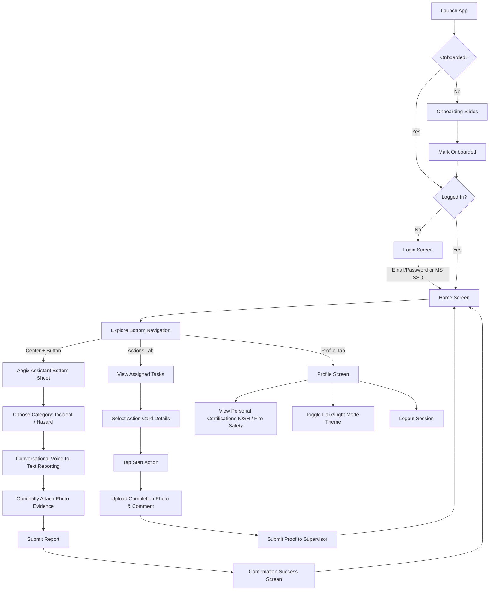

# Aegix HSE Mobile App — End-to-End Documentation

Welcome to the comprehensive technical and operational documentation of the Aegix Health, Safety, and Environment (HSE) Mobile Application. This document provides a complete guide to the project's architecture, user journeys, step-by-step flows, and technical implementation details.

---

## 1. Project Overview
Aegix is a premium, state-of-the-art HSE mobile application built with **Flutter**. Designed for industrial workers and safety teams, it facilitates the immediate, hassle-free reporting of workplace incidents and hazards. 

### Key Features
*   **Onboarding Carousel**: Streamlined introduction to application features.
*   **Secure Authentication**: Dual authentication options including local credential logins and Microsoft Single Sign-On (Azure AD).
*   **AI-Powered Voice Reporting**: Real-time voice-to-text recording, allowing users to speak their report descriptions naturally, coupled with live transcription.
*   **Visual Evidence Attachment**: Gallery or camera uploads for capturing visual proof.
*   **Action Tracking System**: Task manager allowing supervisors to assign corrective actions to field workers, who in turn upload completion proof and comment updates.
*   **Professional Certification Tracker**: Keeps users updated on the status (active/expired) of critical occupational certifications (e.g., IOSH HSE, Fire Safety).
*   **Real-time Notifications Drawer**: Provides live status updates on reports, actions, and safety certifications.
*   **Dynamic Theme System**: Fluid light/night mode toggle which persists across user sessions.

---

## 2. Technical Stack & Dependencies
The application relies on a modular architecture backed by standard Flutter ecosystems.

### Core Technologies
*   **Framework**: Flutter (Dart)
*   **Routing**: `go_router` (declarative path routing)
*   **State Management**: `provider` (MVVM architecture pattern)
*   **Local Persistence**: `shared_preferences` (storing onboarding status, session tokens, and theme settings)

### Key Packages
| Package | Purpose |
| :--- | :--- |
| `flutter_sound` | Manages low-level audio recording and microphone state control. |
| `speech_to_text` | Dictation API utilized to convert live speech input into editable text. |
| `flutter_appauth` | Handles secure Microsoft SSO authorization flow. |
| `image_picker` | Grants access to the camera and native device gallery. |
| `modal_progress_hud_nsn` | Renders clean modal loader overlays during background network tasks. |

---

## 3. Directory Structure & Architecture
The codebase follows a clean-separation architecture:

```
lib/
├── main.dart                      # App entry point, dependency injections & providers setup
├── bottom_nav.dart                # Shell controller containing bottom navigation and Aegix sheet
├── onboarding_screen.dart         # Intro slide screens carousel
├── login.dart                     # User login screen supporting forms & Microsoft SSO
├── home_screen.dart               # Home hub displaying quick stats and recent reports
├── notification_screen.dart       # Live system notification list
├── create_report_screen.dart      # Alternative reporting view
├── new_report_screen.dart         # Primary voice-to-text conversational report creator
├── success_screen.dart            # Submit success notification screen
├── report_agent.dart              # Assistant choice screen (Incident vs Hazard)
├── voice_to_speech.dart           # Text-to-speech test/debug utility
│
├── actions/                       # Core actions/tasks assignment module
│   ├── actions_screen.dart        # List of Open/In-Progress/Completed tasks
│   ├── actions_details.dart       # Detailed summary of an assigned task
│   ├── start_action_details.dart  # Form to complete task (proof upload, comments)
│   ├── filter_screen.dart         # Action filter panel
│   └── action_success.dart        # Progress success confirmation screen
│
├── api/                           # Network request services (services layer)
│   ├── api_status.dart            # Network status models (Success/Failure wrappers)
│   ├── auth_service.dart          # Local session & credentials keeper
│   ├── login_service.dart         # standard credentials login API calls
│   ├── microsoft_auth_service.dart# Azure Active Directory SSO helper
│   ├── profile_service.dart       # User details & certifications API
│   └── report_service.dart        # Incident/Hazard retrieval and submission API
│
├── model/                         # Data serialization models
│   ├── login_model.dart           # JSON parsing for logins
│   ├── user_model.dart            # JSON parsing for user profiles
│   └── reports_model.dart         # JSON parsing for HSE reports
│
├── view_model/                    # Providers managing state & UI updates (logic layer)
│   ├── login_view_model.dart      # Controls logins, loaders & session storage
│   ├── profile_view_model.dart    # Manages profile data retrieval & certifications
│   ├── report_view_model.dart     # Manages report creation payloads & submission states
│   └── theme_provider.dart        # Manages globally active application theme colors
│
├── component/                     # Modular reusable UI widgets
│   ├── custom_app_bar.dart        # Standard screen back-button header
│   ├── custom_button.dart         # Stylized button designs
│   ├── custom_textfield.dart      # Input field wrapper with error validations
│   ├── custom_textarea.dart       # Multi-line text inputs for descriptions
│   └── loader.dart                # Loading spinners
│
├── constant/                      # Global extensions and config parameters
│   └── extension.dart             # Input validators (email, passwords)
│
├── theme/                         # Theme definitions
│   └── theme.dart                 # Color palettes (Light/Dark themes)
│
└── utils/                         # Global helper files
    ├── app_colours.dart           # App-wide color scheme definitions
    ├── app_file_paths.dart        # Asset file path locations (svg/png)
    ├── network_handler.dart       # HTTP requests controller (get/post requests)
    ├── router.dart                # App routing path structures
    └── url_paths.dart             # Backend API endpoint definitions
```

---

## 4. End-to-End User Journey



### Step 1: Onboarding Carousel
*   **User Experience**: On first launching the app, the user is greeted by a high-fidelity sliding interface featuring 3 presentation cards:
    1.  *Safety Starts With You*: Highlights the user's role in maintaining safety.
    2.  *Report in Seconds*: Mentions the simplicity of uploading audio/photos.
    3.  *Safety Made Visible*: Introduces the real-time action tracking system.
*   **Navigation**: The user can press **Skip** to jump to the end, or tap **Next**. On the final page, the **Get Started** button stores `isOnboarded` as `true` in local storage and redirects the user to the login screen.

### Step 2: Authentication & Sessions
*   **User Experience**: Displays a clean form header with a Microsoft SSO option.
*   **Credentials Login**: Validates inputs dynamically (checks email formatting and password requirements). Tapping **Login** triggers the login API request, loads an overlay loader, and if successful, saves user properties (auth token, email, user ID) in `SharedPreferences` before pushing the user to the dashboard.
*   **Microsoft SSO Integration**: Tapping the Microsoft button starts an interactive login via `flutter_appauth` using predefined client and tenant IDs. On successful Microsoft sign-in, the secure token is saved, redirecting the user straight to the application layout.

### Step 3: Main Navigation Shell (Bottom Navigation)
*   **User Experience**: An elegant custom-built navigation shell anchors the bottom of the screen.
*   It organizes the primary features into tabs:
    *   **Home (Index 0)**: Displays user greeting, location, active statistics (total reports, open reports, high-risk items, pending reviews), and a list of recent reports.
    *   **Reports (Index 1)**: Lists all reports submitted by the employee.
    *   **Center FAB (Index 2)**: Triggers the conversational reporting bottom sheet.
    *   **Actions (Index 3)**: Accesses task management (assigned corrective tasks).
    *   **Profile (Index 4)**: Hosts user statistics, certifications, profile modifications, night mode toggle, and logout actions.

### Step 4: Conversational Voice-to-Text Reporting Flow
This is the core highlight of the application, utilizing voice recognition to minimize manual logging.

1.  **Opening Aegix Assistant**: The user taps the central **+** button. An assistant bottom sheet slides up, introducing "Aegix Assistant".
2.  **Choosing Category**: Tapping "Start Report" navigates to the category selector page, asking the user to choose between:
    *   *Incident*: An event that occurred but did not lead to severe injury.
    *   *Hazard*: A dangerous condition or event causing harm/damage.
3.  **Initiating Voice Recording**: The app requests device microphone permissions dynamically. Once allowed, the user taps the mic button. The UI replaces the scrollable panel with an animated loader notifying the user that the app is listening.
4.  **Speech Transcription**: As the user speaks, `speech_to_text` converts audio signals to text in real-time, showing it dynamically on screen.
5.  **Reviewing & Fallback Handling**:
    *   If the user stops speaking, the app waits for final results.
    *   If no voice transcription is captured (e.g. noisy environments), the app handles the error gracefully by loading a default scenario text as a placeholder and alerting the user via SnackBar.
    *   The transcribed description is displayed inside an editable bubble widget, enabling manual typo corrections.
6.  **Attaching Images**: The user can tap the "Attach Image" placeholder card to launch a selector menu, choosing either **Camera** (to snap a live photo) or **Gallery** (to import an existing photo).
7.  **Finalizing & Submitting**: Tapping **Submit** packages the data payload (including risk levels, date/time, descriptions, and site details) and posts it to the backend via `ReportViewModel`. Upon success, the app shows the confirmation screen and returns the user to the main menu.

### Step 5: Action Tracking (Corrective Tasks)
*   **User Experience**: Safety supervisors can assign corrective tasks to users.
*   **Dashboard List**: Under the **Actions** tab, users view tasks separated into filterable columns: "All", "Open", and "In Progress".
*   **Details View**: Tapping any task card opens its description, displaying:
    *   Assigned location & due dates.
    *   Assisting supervisor name.
    *   Option to click "View related report" to review the original incident description.
*   **Execution & Proof Upload**:
    *   The worker clicks **Start Action** to flag the task as "In Progress".
    *   The interface updates, presenting image uploading slots and an optional comment field.
    *   The user uploads up to 4 photos demonstrating completion proof (e.g. cleaned oil spill or secured loose cable) and submits the action.
    *   The system updates the status and notifies the supervisor for final review.

### Step 6: Profile & Night Mode Toggle
*   **User Experience**: Tapping the **Profile** tab displays stats, certifications, and theme toggles.
*   **Certification Tracker**: Selecting **Certifications** pulls up user certifications like "Certified HSE Officer" or "Fire Safety Training" with badge overlays marked "Active" (green) or "Expired" (red).
*   **Night Mode Toggle**: Tapping the "Night Mode" row communicates with `ThemeProvider`. The app changes its active theme instantly, saving the theme value locally to preserve the style during future launches.

---

## 5. Technical Flow & State Management

### MVVM State Architecture
The project runs on a standard Model-View-ViewModel (MVVM) structure using the `Provider` package to handle data scopes and keep the UI clean:

```
┌─────────────────┐       Retrieves Data       ┌──────────────────────┐
│  REST API / DB  │ <───────────────────────── │   Service Modules    │
└─────────────────┘                            └──────────────────────┘
         │                                                 ▲
         │ Returns JSON Payload                            │ Makes HTTP Calls
         ▼                                                 │
┌─────────────────┐       Updates Provider     ┌──────────────────────┐
│   Data Models   │ ─────────────────────────> │     View Models      │
└─────────────────┘                            └──────────────────────┘
                                                           │
                                                           │ Rebuilds UI State
                                                           ▼
                                               ┌──────────────────────┐
                                               │      UI Screen       │
                                               └──────────────────────┘
```

1.  **View Models (Controllers)**:
    *   `LoginViewModel`: Controls login loading indicators, processes credential validation, and executes login operations.
    *   `ProfileViewModel`: Pulls user profile details and certifications, managing loading overlays.
    *   `ReportViewModel`: Processes incident/hazard submissions and fetches historical reports.
    *   `ThemeProvider`: Toggles the global theme colors and saves selected configurations.
2.  **API Services (Network Client)**:
    *   `NetworkHandler`: Wrapper around standard HTTP methods. Automatically attaches authorization headers (`Bearer <token>`) to outgoing secure requests and maps response status codes.
    *   `AuthService`: Manages local persistence for user sessions and state.
3.  **Exceptions & Error Handling**:
    *   Uses custom response handlers wrapping failures into `AuthError` and `DataError` models.
    *   Displays error feedback overlays (SnackBar and `CustomFlushBar`) in case of socket timeouts, incorrect parameters, or server failures.

---

## 6. Developer Guidelines & Testing
Follow these standard workflows for testing or executing code modifications:

### Running the App Locally
Run the app in debug mode on a simulator or physically connected device:
```bash
flutter run
```

### Code Formatting and Linting
Ensure all code matches style guidelines before submitting pull requests:
```bash
flutter format lib/
flutter analyze
```

### State Modification Rules
*   Do not initialize state directly in views. Always place API and state mutations inside their respective **View Models**.
*   Verify that any async actions affecting UI check the `mounted` state or use a local component safety check (e.g. `_isMounted`) before calling `setState` or modifying context. Refer to the implementation in `NewReportScreen` to prevent memory leaks during unmounts.
